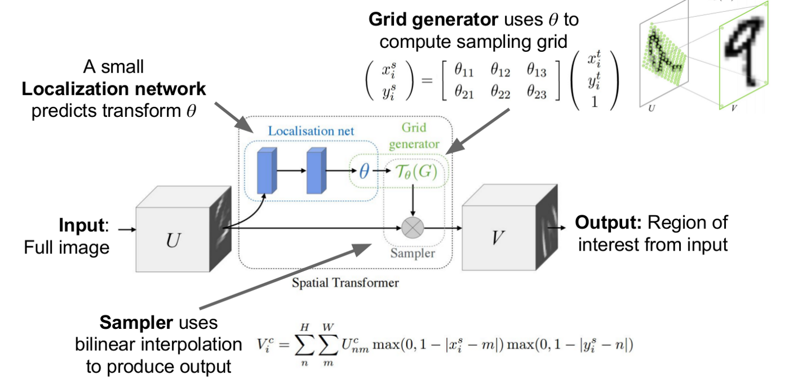
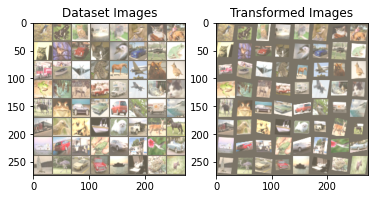

# Spatial Transformer

This module consists of layers of neural networks that can spatially transform an image. These include cropping, scaling, rotations, and translations etc

CNNs perform poorly when the input data contains so much variation. One of the solutions to this is the max-pooling layer. But then again, max-pooling layers do no make the CNN invariant to large transformations in the input data.

This gives rise to the concept of Spatial Transformer Networks. In STNs, the transformer module knows where to apply the transformation to properly scale, resize, and crop and image. We can apply the STN module to the input data directly, or even to the feature maps (output of a convolution layer). In simple words, we can say that the spatial transformer module acts as an attention mechanism and knows where to focus on the input data.




### Notebook Link


### Model Summary


```
Net(
  (conv1): Conv2d(3, 16, kernel_size=(5, 5), stride=(1, 1))
  (conv2): Conv2d(16, 32, kernel_size=(5, 5), stride=(1, 1))
  (conv2_drop): Dropout2d(p=0.5, inplace=False)
  (fc1): Linear(in_features=800, out_features=1024, bias=True)
  (fc2): Linear(in_features=1024, out_features=10, bias=True)
  (localization): Sequential(
    (0): Conv2d(3, 64, kernel_size=(7, 7), stride=(1, 1))
    (1): MaxPool2d(kernel_size=2, stride=2, padding=0, dilation=1, ceil_mode=False)
    (2): ReLU(inplace=True)
    (3): Conv2d(64, 128, kernel_size=(5, 5), stride=(1, 1))
    (4): MaxPool2d(kernel_size=2, stride=2, padding=0, dilation=1, ceil_mode=False)
    (5): ReLU(inplace=True)
  )
  (fc_loc): Sequential(
    (0): Linear(in_features=2048, out_features=256, bias=True)
    (1): ReLU(inplace=True)
    (2): Linear(in_features=256, out_features=6, bias=True)
  )
)
```


### Training Log

```
Test set: Average loss: 1.8995, Accuracy: 3176/10000 (32%)

Train Epoch: 2 [0/50000 (0%)]	Loss: 1.871511
Train Epoch: 2 [32000/50000 (64%)]	Loss: 1.892032

Test set: Average loss: 1.8057, Accuracy: 3620/10000 (36%)

Train Epoch: 3 [0/50000 (0%)]	Loss: 1.876215
Train Epoch: 3 [32000/50000 (64%)]	Loss: 1.802190

Test set: Average loss: 2.0792, Accuracy: 2892/10000 (29%)

Train Epoch: 4 [0/50000 (0%)]	Loss: 1.951564
Train Epoch: 4 [32000/50000 (64%)]	Loss: 1.684780

Test set: Average loss: 1.6482, Accuracy: 4281/10000 (43%)

Train Epoch: 5 [0/50000 (0%)]	Loss: 1.756712
Train Epoch: 5 [32000/50000 (64%)]	Loss: 1.737274

Test set: Average loss: 1.4756, Accuracy: 4776/10000 (48%)

Train Epoch: 6 [0/50000 (0%)]	Loss: 1.763594
Train Epoch: 6 [32000/50000 (64%)]	Loss: 1.573449
show more (open the raw output data in a text editor) ...

Train Epoch: 50 [0/50000 (0%)]	Loss: 0.710291
Train Epoch: 50 [32000/50000 (64%)]	Loss: 0.656993

Test set: Average loss: 1.3017, Accuracy: 5897/10000 (59%)
```


### Model Results

