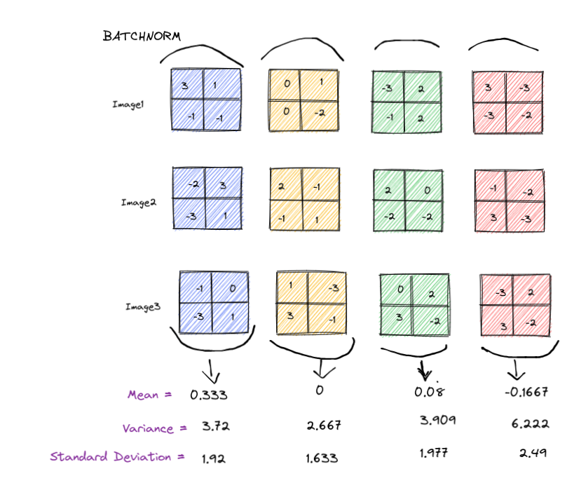
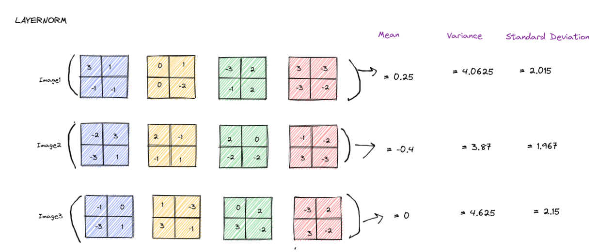
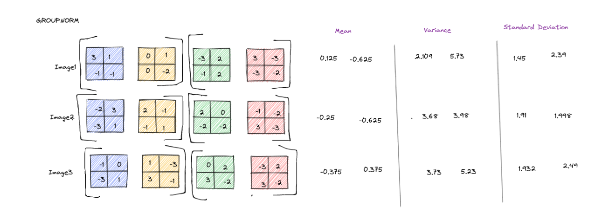
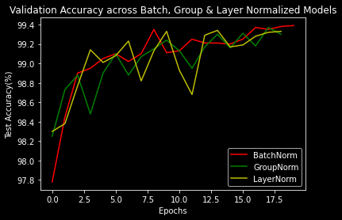
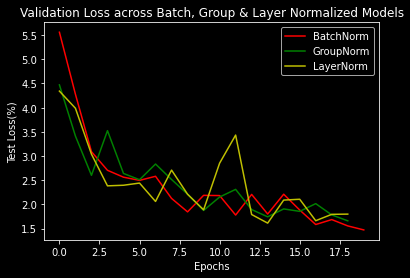
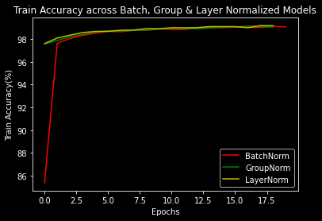
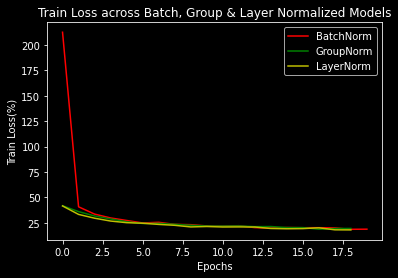

# S6 Assignment
Your 6th Assignment is:

        You are making 3 versions of your 5th assignment's best model (or pick one from best assignments):
        Network with Group Normalization
        Network with Layer Normalization
        Network with L1 + BN
        You MUST:
        Write a single model.py file that includes GN/LN/BN and takes an argument to decide which normalization to include
        Write a single notebook file to run all the 3 models above for 20 epochs each
        Create these graphs:
        Graph 1: Test/Validation Loss for all 3 models together
        Graph 2: Test/Validation Accuracy for 3 models together
        graphs must have proper annotation
        Find 10 misclassified images for each of the 3 models, and show them as a 5x2 image matrix in 3 separately annotated images. 
        write an explanatory README file that explains:
        what is your code all about,
        how to perform the 3 covered normalization (cannot use values from the excel sheet shared)
        your findings for normalization techniques,
        add all your graphs
        your 3 collection-of-misclassified-images 
        Upload your complete assignment on GitHub and share the link on LMS

# About Assignment

Implement Group and Layer Normalization, test how they perform against Batchnorm. Also modularize everything. 

# File Structure

[EVA6_S6.ipynb](Assignments/S6/EVA6_S6.ipynb): Main Colab notebook with all models inside it. I created a simple torch utility package and using it here. Link to torchkit.

[torchkit](https://github.com/Gilf641/EVA-6/tree/main/torchkit): Custom Pytorch Utility package

# Normalization & its Types

Normalization sounds complex, how about modifiying the pixel value/intensity ranges. So there are 3 types of Normalization techniques, Batch, Group and Layer Normalization. 

Batch Norm is most commonly used and works for all batch sizes. While Group and Layer work really well for small batches. 

Assume we have 3 images with 4 channels of size 2x2. Now let's BatchNorm

1. **BatchNormalization**

    BatchNorm will make sure that the channel(pixel) values are in proper range, so that training becomes easier, faster and simpler. Here's a representation of BatchNorm

BN calculates a mean and variance for each channel. During Backprop, Gamma and Beta get trained. So in total, for each channel 4 parameters, 2 trainable, 2 non-trainable.
BN normalizes a particular channel of all images in that batch at once. 

2. **LayerNormalization**

    Here in LayerNorm, things are bit different. Here normalization is done for all channels of mini-batch of images at once. Here's a represenation of LayerNorm

3. **GroupNormalization**

    Similar to LayerNorm, but normalized in groups. Here normalization is done for a group channels of mini-batch of images at once. Here's a represenation of GroupNorm

* **Notes on Normalization**

I guess, the main aim to use any kind of normalization is to have pixel values, weights, etc all under one or atleast similar range. This avoids Gradient Explosion.

Now coming to different types, Batchnorm works well with large batch size, while Groupnorm and Layernorm, work with small batches. This is because, in smaller batches, batch stats are too random and increases the error for BN. While Batchnorm is kinda dependent on Batch size, Groupnorm is stable across different batch sizes.

# Main Assignment

**[S6 Assignment Solution](https://github.com/Gilf641/EVA-6/blob/main/Assignments/S6/EVA6_S6.ipynb)**

Modularized the pipeline, now I have a model package, from where I can import any model and run inside colab. 

## Data Visualization
(*forgot to mention L1+BN in plots*)

* **Validation Accuracy** 

* **Validation Loss** 

* **Train Accuracy** 

* **Train Loss** 

* **20 Misclassified Images**

| L1 + BatchNorm | LayerNorm | GroupNorm |
|:-------------------------:|:-------------------------:|:-------------------------:|
|   |  ||

# Analysis

1. I think that, both are doing what they're good at. Batchnorm works really well with higher batch size, since batch statistics are not too random. While Groupnorm works good with small batches, where stats are arbitrary.

2. As expected Batchnorm has performed well against these two with batch size of 128. 

  
