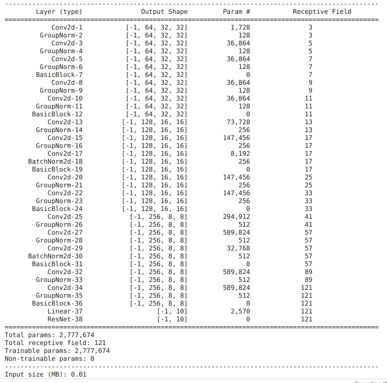

# S8 Assignment

Task: 

    Go through this repository: https://github.com/kuangliu/pytorch-cifar (Links to an external site.)
    Extract the ResNet18 model from this repository and add it to your API/repo. 
    Use your data loader, model loading, train, and test code to train ResNet18 on Cifar10
    Train for 40 Epochs
    20 misclassified images
    20 GradCam output on the SAME misclassified images
    Apply these transforms while training:
    RandomCrop(32, padding=4)
    CutOut(16x16)
    Rotate(±5°)
    Must use ReduceLROnPlateau
    Must use LayerNormalization ONLY

**Assignment Solution**: 

## **Model Features:**

1. Used GPU
2. ResNet Variant: ResNet18
3. Total Params: 2,777,674
4. Used only 3 basic blocks, to get final output > 7x7 for Gradcam.
5. Used NLLoss() to calculate loss value.
7. Ran the model for 40 Epochs with 

        * Highest Train Accuracy: 91.84% 

        * Corresponding Test Accuracy: 89.22% 

* **Model Analysis:**
1. Lot of fluctuations in Validation Loss values. 
2. Not that Overfit Model.
3. In Misclassified Images, one can see that most of images are either hidden / occluded / oriented in different way. Also in some images the class deciding portions is kinda dark. Eg: AirPlane Image (2nd Row, 4th Column) with it's wings, rear parts are not that visible. Front portion of Truck( 5th row, 2nd column)is excluded.

# Main Assignment

**[S7 Assignment Solution](Assignments/S7/S7_Assignment.ipynb)**

Modularized the pipeline, now I have a model package, from where I can import any model and run inside colab. 

## Model Performance Analysis

|Accuracy| Loss|
|-------------------------|-------------------------|
|||
|||

* **Misclassified images**

# Analysis

1. Adding Dilation doesn't mean increase in accuracy
2. As expected Depthwise Convolution, did reduce the accuracy at the cost of less params.
3. Without Dilation, Classifier would perform much better. 

# MODEL 2:

[CIFAR-10 Model](https://github.com/Gilf641/EVA-6/blob/master/Assignments/S7/S7_Assignment(168k_RF85).ipynb)
        
        
* **Model Features:**

1. Used GPU
2. Receptive Field = 85
3. Total Params = 168_724
3. Used 2 Depthwise Separable Convolution layers
4. Used 1 Dilated Convolution layer
5. Since the model was overfitting, I used Dropout of 5%.
6. Ran the model for 100 Epochs
7. Max Validation Accuracy = 85.5%

# Main Assignment

**[S7 Assignment Solution](https://github.com/Gilf641/EVA-6/blob/master/Assignments/S7/S7_Assignment(168k_RF85).ipynb)**

Modified [my torch package](https://github.com/Gilf641/EVA-6/tree/master/torchkit) by adding torchsummary with a Receptive Field Column . This makes the process slightly easier

## Model Performance Analysis

|Accuracy| Loss|
|-------------------------|-------------------------|
|||
|||

* **Misclassified images**

# Analysis

1. Adding Dilation especially in the initial layers, doesn't improve model performance
2. OnecycleLr has affected and improved model accuracy rate.

## **Misclassified Images**

